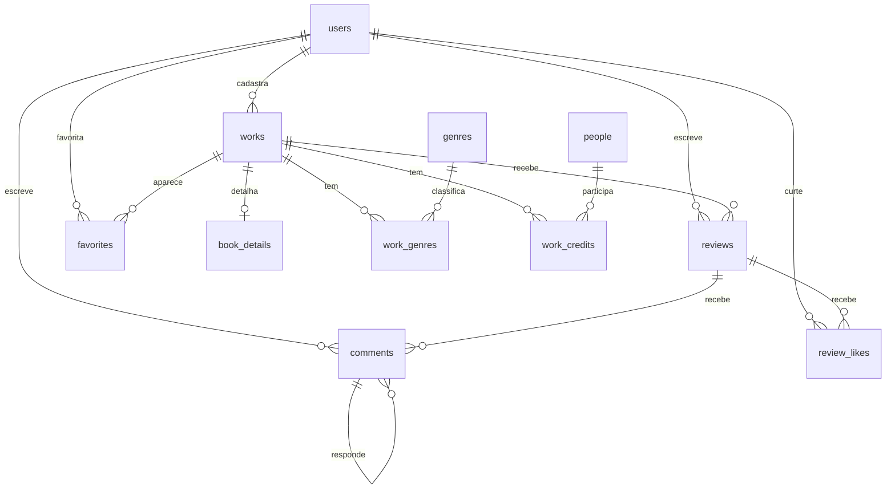

# Banco de dados

Como o banco do Book Shelf é modelado, criado e alterado. Vale para todo mundo
do grupo, não só para quem mexe no backend.

**Responsável:** Mariana (modelagem, migrations, schema)
**Complementa:** [GIT-WORKFLOW.md](GIT-WORKFLOW.md) e [ENTREGAS.md](ENTREGAS.md)
— as regras de branch, commit e PR estão lá e não se repetem aqui.

---

## 0. Decisões pendentes — ler antes de tudo

Três pontos onde o repositório e o que foi combinado no grupo não batem. Cada um
muda o schema, então precisam ser fechados **antes da AC1 (14/09)**.

### 0.1 Quem cadastra livro?

O `README.md` da raiz diz *"Usuários cadastram livros"*. Mas foi combinado que
**só o administrador** cadastra.

São coisas diferentes e a AC1 é exatamente essa funcionalidade. O schema já
suporta as duas: a tabela `users` tem `role` (`user` / `admin`) e `works` tem
`created_by`. O que muda é a rota do Flask — se for só admin, ela precisa de um
`@admin_required`; se for qualquer usuário logado, não.

**Enquanto não decidir**, o modelo assume *só admin*, que é o mais restritivo.
Soltar depois é fácil; apertar depois quebra dados já cadastrados.

### 0.2 Livro só, ou livro e filme?

O `README.md`, o `ENTREGAS.md` e o próprio nome do repositório falam **só de
livros**. As quatro entregas são todas sobre livro. Mas foi descrito como
avaliador de *livros e filmes*.

A tabela se chama `works` e tem uma coluna `type`, hoje sempre `'book'`. Isso
resolve os dois casos: se filme entrar, cria-se `movie_details` e libera-se
`type = 'movie'`, sem mexer em nenhuma FK. Se ficar só livro, a coluna `type`
custa 1 byte por linha.

Por que não duas tabelas `books` e `movies`: `reviews`, `comments` e `favorites`
precisariam de dois FKs opcionais cada, com a regra *"exatamente um preenchido"*
impossível de garantir no banco, e toda consulta de listagem viraria `UNION`.

> Nome técnico da solução: **herança por tabela de classe**. Serve de argumento
> na apresentação.

**Se o grupo decidir que é só livro, para sempre:** renomear `works` para
`books` e remover `type`. Fazer isso **antes da AC1**, porque depois exige
migration de renomear tabela.

### 0.3 "Comentários" da AC2 é o quê?

O cronograma tem AC2 = *"Avaliação de livro — comentários"* e AC3 = *"Avaliação
de livro — notas"*. Duas leituras possíveis:

- **(a)** o comentário é o texto da própria avaliação → é a coluna
  `reviews.body`. AC3 depois adiciona `reviews.rating`.
- **(b)** o comentário é uma resposta de outra pessoa à avaliação → é a tabela
  `comments`.

O modelo entregue cobre as duas, mas **(a) é a leitura assumida**, porque em (b)
a AC2 dependeria de já existir avaliação, que só chega na AC3 — a ordem do
cronograma não fecha. A tabela `comments` fica como extra.

**Consequência direta:** `reviews.rating` é `NULL`, não `NOT NULL`. Se fosse
obrigatória, a AC2 não teria como gravar um comentário sem nota. Um `CHECK`
garante que pelo menos um dos dois (nota ou texto) exista.

---

## 1. As três regras que ninguém quebra

1. **Ninguém altera tabela na mão.** Nem pelo Adminer, nem por `ALTER TABLE` no
   terminal. Toda mudança de estrutura vira migration. Quem mexe na mão fica com
   um banco diferente do resto do grupo, e o erro só aparece na máquina de
   outra pessoa.
2. **`docs/schema.sql` é documentação, não é executado.** Quem cria as tabelas é
   `flask db upgrade`.
3. **Nunca colocar SQL em `infra/mysql/init/`.** Aquela pasta é executada pelo
   MySQL na primeira subida do container. Se o schema estiver lá, as tabelas
   nascem por fora do Alembic e o `flask db upgrade` falha dizendo que a tabela
   já existe. A pasta fica vazia de propósito.

---

## 2. Subindo o ambiente

O combinado do grupo (ver `backend/README.md`): **MySQL no Docker, Python
local**.

```bash
# --- na raiz do repositório ---
docker compose up -d
docker compose ps                  # STATUS do mysql deve ficar "healthy"

# --- em backend/ ---
cd backend
python3.12 -m venv .venv
source .venv/bin/activate          # Windows: .venv\Scripts\activate
pip install -r requirements.txt

cp .env.example .env               # Windows: copy .env.example .env

flask db upgrade                   # cria as tabelas
flask seed                         # popula dados de teste
flask run                          # http://localhost:5000/api/health
```

**Conferindo:** <http://localhost:8080> (Adminer) → Servidor `mysql`, usuário
`bookshelf`, senha `bookshelf`, base `bookshelf`. Ou:

```bash
curl http://localhost:5000/api/health
```

### Se der errado

| Sintoma | Causa provável |
|---|---|
| `Can't connect to MySQL server` | Container não subiu. `docker compose ps` |
| `Access denied for user` | `.env` não foi criado, ou senha diferente do compose |
| `No module named 'MySQLdb'` | Faltou `PyMySQL`. Confira o `+pymysql` na `DATABASE_URL` |
| `Table ... already exists` | Alguém criou tabela por fora do Alembic. Ver regra 3 |
| Porta 3306 ocupada | Já tem MySQL instalado na máquina. Pare o serviço local |

**Zerar tudo** (só enquanto não tem dado que importa):

```bash
docker compose down -v && docker compose up -d
cd backend && flask db upgrade && flask seed
```

---

## 3. Convenções

| Item | Regra | Exemplo |
|---|---|---|
| Tabela | `snake_case`, plural, inglês | `reviews`, `work_genres` |
| Coluna | `snake_case`, singular | `release_year` |
| Chave primária | sempre `id`, `BIGINT UNSIGNED` | `users.id` |
| Chave estrangeira | `<tabela_singular>_id` | `work_id` |
| Associativa (N:N) | nome das duas tabelas | `work_genres` |
| Índice | `idx_<tabela>_<colunas>` | `idx_reviews_work_created` |
| Única | `uq_<tabela>_<colunas>` | `uq_reviews_user_work` |
| Check | `ck_<tabela>_<regra>` | `ck_reviews_rating` |
| Booleano | prefixo `is_` / `has_` | `is_active`, `has_spoilers` |
| Datas | `created_at` e `updated_at` em toda tabela principal | — |

**Regras de tipo que não se negocia:**

- Nota é `DECIMAL(2,1)`, **nunca** `FLOAT`. Em float, `4.5` vira `4.4999999` e a
  média sai errada na terceira casa.
- PK e FK sempre `UNSIGNED`. No MySQL a FK precisa ter *exatamente* o mesmo tipo
  da PK que referencia. Se esquecer o `UNSIGNED` de um lado, o erro é o 3780,
  que não explica nada. Use os aliases `PK` e `SMALL_U` de
  `app/models/base.py`.
- Charset `utf8mb4` e engine `InnoDB` sempre.
- Data e hora ficam em UTC no banco; a conversão de fuso é na aplicação.

---

## 4. O modelo

### 4.1 Diagrama



### 4.2 Tabelas por entrega

| Entrega | Data | Cartão | Tabelas envolvidas |
|---|---|---|---|
| AC1 | 14/09 | R001 | `users`, `works`, `book_details` (+ `genres`, `work_genres`, `people`, `work_credits` se der tempo) |
| AC2 | 13/10 | R002 | `reviews` — só `body` |
| AC3 | 08/11 | R003 | `reviews` — adiciona `rating` |
| Final | 22/11 | R004 | `favorites` |
| — | — | extra | `comments`, `review_likes` |

**Isso define a sequência das migrations.** Não gere tudo de uma vez: a AC2 deve
criar `reviews` sem a coluna `rating`, e a AC3 deve adicionar a coluna. Duas
migrations reais, em sprints diferentes, mostrando o processo funcionando. Os
models entregues são o estado **final**; cada campo está marcado com `[AC2]`,
`[AC3]` etc.

### 4.3 O que o banco garante sozinho

Estas regras não dependem de ninguém lembrar de validar no código. Todas foram
testadas contra um banco real:

| Regra | Como |
|---|---|
| Um usuário só avalia o mesmo livro uma vez | `UNIQUE (user_id, work_id)` em `reviews` |
| Nota entre 0.5 e 5.0, de meio em meio | `ck_reviews_rating` |
| Avaliação não pode ser vazia (sem nota **e** sem texto) | `ck_reviews_nota_ou_texto` |
| Não dá pra favoritar o mesmo livro duas vezes | PK composta em `favorites` |
| Não dá pra curtir a mesma avaliação duas vezes | PK composta em `review_likes` |
| E-mail e username únicos | `UNIQUE` em `users` |
| Ano de lançamento plausível | `ck_works_year` |
| Livro não pode apontar para usuário inexistente | FK em `works.created_by` |
| Apagar usuário apaga as avaliações e favoritos dele | `ON DELETE CASCADE` |
| Não dá pra apagar quem cadastrou livros | `ON DELETE RESTRICT` |

### 4.4 O que a APLICAÇÃO precisa garantir

O banco **não** cuida destas. Viram card no Trello:

- **Permissão de cadastro** (ver 0.1). O banco aceita qualquer `created_by`.
- **Dono do conteúdo:** usuário só edita/apaga a própria avaliação.
- **Hash de senha** antes de salvar. `werkzeug.security.generate_password_hash`
  já está no `requirements.txt`.
- **Coerência de tipo:** obra `type='book'` não deveria receber crédito de
  `director`.
- **Slug único:** gerar a partir do título e tratar colisão. O banco só recusa a
  duplicata — quem trata o erro é a aplicação.

### 4.5 Média de nota

Não existe coluna `avg_rating` em `works`, de propósito. Média denormalizada
desatualiza toda vez que alguém edita ou apaga uma avaliação. Calcule na
consulta (seção 6).

**Atenção no front:** um livro pode ter avaliação sem nota (o caso da AC2).
Nesse caso `AVG(rating)` volta `NULL`, não zero. A tela precisa mostrar algo como
"sem notas ainda" em vez de "0.0".

---

## 5. Migrations

Usamos **Flask-Migrate** (Alembic embrulhado para Flask). `app/models/` é a
fonte da verdade; o Alembic compara os models com o banco e gera o script da
diferença.

### 5.1 Quando você precisa mudar a estrutura

```bash
cd backend && source .venv/bin/activate

# 1. antes de qualquer coisa: pegar o que já entrou na main
git checkout main && git pull && flask db upgrade

# 2. alterar o model em app/models/

# 3. gerar
flask db migrate -m "adiciona coluna rating em reviews"

# 4. ABRIR o arquivo em migrations/versions/ e LER.  <-- não pule
# 5. aplicar e testar a volta
flask db upgrade
flask db downgrade
flask db upgrade

# 6. commitar o model E a migration juntos
```

**Model novo tem que ser importado em `app/models/__init__.py`.** Se esquecer, o
Alembic não enxerga a tabela e gera uma migration incompleta sem reclamar.

### 5.2 O passo 4 não é formalidade

O autogenerate erra. Aconteceu neste projeto, na primeira migration: o Alembic
gerou um `drop_index` antes de cada `drop_table` no downgrade, e o MySQL recusou
com

```
(1553, "Cannot drop index 'idx_comments_review': needed in a foreign key constraint")
```

O motivo: quando existe um índice composto que começa pela coluna da FK, o MySQL
adota esse índice como índice da FK em vez de criar o dele. Aí não deixa dropar.
E as chamadas eram redundantes — `drop_table` já remove os índices da tabela.

A migration entregue já vem com o downgrade corrigido à mão, com essa explicação
no comentário. Duas lições que valem para as próximas:

- **Não crie índice explícito em coluna que já é FK sozinha.** O MySQL cria um
  automaticamente. `Index("idx_comments_user", "user_id")` era puro peso morto e
  ainda quebrava o downgrade.
- **Sempre teste o downgrade.** Se você só roda `upgrade`, o erro fica escondido
  até alguém precisar voltar — provavelmente na véspera da entrega.

Outras coisas que o autogenerate costuma errar: renomear coluna (vira
`drop` + `add`, e **perde os dados**), mudança de tipo, e `CHECK` constraint.

### 5.3 Comandos

| Comando | O que faz |
|---|---|
| `flask db migrate -m "msg"` | Gera a migration comparando models com o banco |
| `flask db upgrade` | Aplica as pendentes |
| `flask db downgrade` | Desfaz a última |
| `flask db current` | Em que versão seu banco está |
| `flask db history` | Histórico |
| `flask db heads` | Se aparecer mais de uma linha, tem conflito |

Mensagem no padrão `"<verbo> <o quê> em <tabela>"`. Bom:
`"adiciona coluna rating em reviews"`. Ruim: `"update"`, `"fix"`.

### 5.4 Duas migrations ao mesmo tempo

Se duas pessoas geram migration a partir do mesmo ponto, cada uma aponta para o
mesmo pai e o Alembic fica com duas cabeças. O `upgrade` reclama de
*multiple heads*.

**Prevenção:** só gera migration quem estiver com um cartão de banco na sprint.
Precisa de uma coluna? Peça no Trello. E sempre `git pull` + `flask db upgrade`
antes de gerar.

**Se acontecer:**

```bash
flask db heads
flask db merge -m "merge de migrations" <head1> <head2>
flask db upgrade
```

### 5.5 Checklist do PR de banco

Some ao checklist do `pull_request_template.md`:

- [ ] Model e migration no mesmo commit
- [ ] `flask db upgrade` roda a partir de banco vazio
- [ ] `flask db downgrade` roda sem erro
- [ ] `flask seed` roda depois do upgrade
- [ ] `docs/schema.sql` atualizado
- [ ] Este documento atualizado, se mudou alguma regra

---

## 6. Consultas prontas

Para quem for fazer os endpoints.

```sql
-- Tela do livro: dados + média + contagem.
-- COUNT(r.rating) conta só quem deu nota; COUNT(r.id) conta todas as
-- avaliações. Os dois números são diferentes e a tela precisa dos dois.
SELECT w.id, w.title, w.release_year, w.cover_url,
       COUNT(r.id)             AS total_avaliacoes,
       COUNT(r.rating)         AS total_notas,
       ROUND(AVG(r.rating), 2) AS media
FROM works w
LEFT JOIN reviews r ON r.work_id = w.id
WHERE w.slug = 'duna-1965'
GROUP BY w.id, w.title, w.release_year, w.cover_url;

-- Avaliações de um livro, mais recentes primeiro
SELECT r.id, r.rating, r.body, r.has_spoilers, r.created_at,
       u.username, u.avatar_url
FROM reviews r
JOIN users u ON u.id = r.user_id
WHERE r.work_id = %s
ORDER BY r.created_at DESC
LIMIT 20;

-- Catálogo com média (listagem da home)
SELECT w.id, w.slug, w.title, w.cover_url,
       ROUND(AVG(r.rating), 2) AS media,
       COUNT(r.rating)         AS total_notas
FROM works w
LEFT JOIN reviews r ON r.work_id = w.id
WHERE w.type = 'book'
GROUP BY w.id, w.slug, w.title, w.cover_url
ORDER BY w.title
LIMIT 20 OFFSET %s;

-- Favoritos do usuário logado
SELECT w.id, w.slug, w.title, w.cover_url, f.created_at
FROM favorites f
JOIN works w ON w.id = f.work_id
WHERE f.user_id = %s
ORDER BY f.created_at DESC;

-- "Este livro está nos meus favoritos?" — para o estado do botão
SELECT EXISTS(
  SELECT 1 FROM favorites WHERE user_id = %s AND work_id = %s
) AS favoritado;

-- Mais bem avaliados, com mínimo de 3 notas.
-- O HAVING evita um livro com uma nota 5 solitária liderar o ranking.
SELECT w.title, ROUND(AVG(r.rating), 2) AS media, COUNT(r.rating) AS notas
FROM works w
JOIN reviews r ON r.work_id = w.id
GROUP BY w.id, w.title
HAVING COUNT(r.rating) >= 3
ORDER BY media DESC, notas DESC
LIMIT 10;

-- Livros de um gênero
SELECT w.id, w.title, w.release_year
FROM works w
JOIN work_genres wg ON wg.work_id = w.id
JOIN genres g       ON g.id = wg.genre_id
WHERE g.slug = 'ficcao-cientifica' AND w.type = 'book'
ORDER BY w.release_year DESC;
```

---

## 7. Dados de teste

```bash
flask seed            # popula (pode rodar várias vezes, não duplica)
flask seed --reset    # apaga os dados e popula de novo
```

Cria 10 gêneros, 3 usuários, 3 livros com autor e gênero, e 3 avaliações —
incluindo **uma só com texto e sem nota**, que é justamente o caso que a AC2
precisa suportar e o que costuma quebrar o front.

Credenciais de desenvolvimento:

| E-mail | Senha | Papel |
|---|---|---|
| `admin@bookshelf.local` | `admin123` | admin |
| `ana@bookshelf.local` | `user123` | user |
| `bruno@bookshelf.local` | `user123` | user |

Todo mundo desenvolvendo com a mesma base facilita revisar PR e gravar o vídeo
da entrega.

---

## 8. Arquivos

| Caminho | O que é |
|---|---|
| `backend/app/models/` | Models SQLAlchemy — a fonte da verdade |
| `backend/app/extensions.py` | Instâncias `db` e `migrate` |
| `backend/app/config.py` | Configuração lida do `.env` |
| `backend/app/__init__.py` | Application factory — blueprints se registram aqui |
| `backend/app/cli.py` | Comando `flask seed` |
| `backend/migrations/` | Gerado pelo Alembic |
| `backend/wsgi.py` | Ponto de entrada (`FLASK_APP`) |
| `backend/.env.example` | Modelo do `.env` |
| `docs/schema.sql` | DDL de referência, não executar |
| `docs/BANCO-DE-DADOS.md` | Este documento |

---

## 9. Glossário

- **Migration:** script versionado que altera a estrutura do banco. É o "commit"
  do banco.
- **Schema:** o desenho das tabelas, colunas, tipos e relacionamentos.
- **ORM (SQLAlchemy):** camada que mapeia classe Python ↔ tabela.
- **Alembic:** ferramenta que gera e aplica as migrations.
- **FK:** coluna que aponta para a chave primária de outra tabela.
- **CASCADE:** apagar o pai apaga os filhos. **RESTRICT:** impede apagar o pai.
- **CHECK:** regra que o banco valida a cada gravação.
- **Soft delete:** marcar como apagado em vez de remover a linha.
- **Seed:** dados iniciais de teste.
